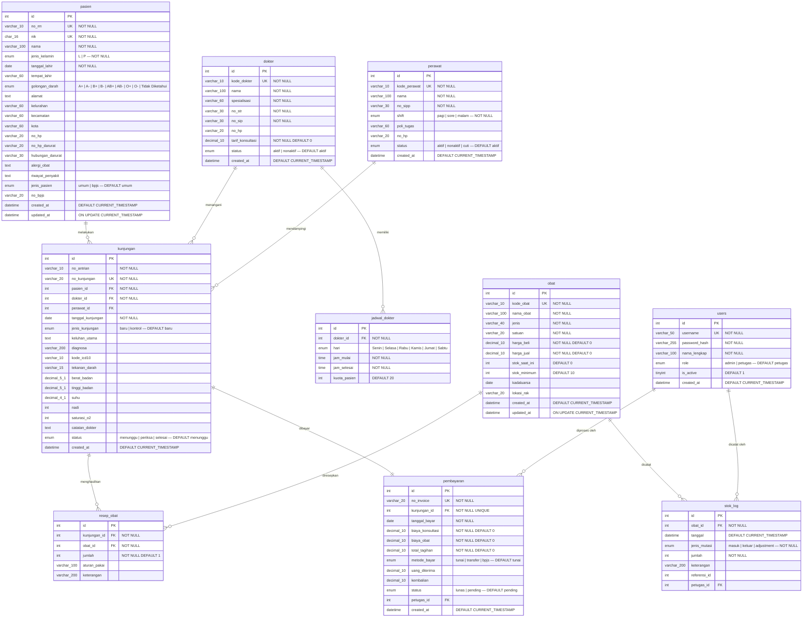
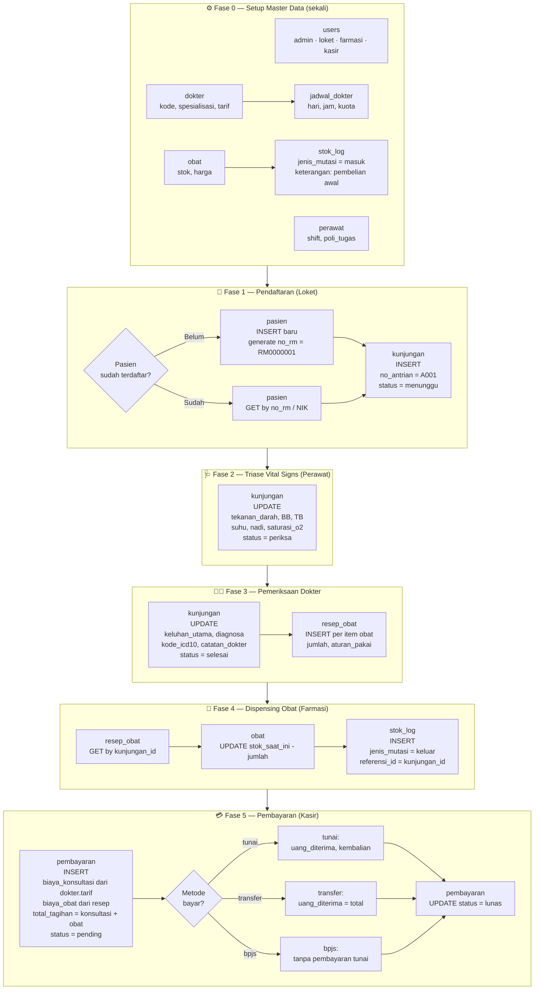

# Alur Data — db_gaharu_medika
> Klinik Gaharu Medika — Database Flow Documentation

---

## Ringkasan 10 Tabel

| # | Tabel | Kategori | Peran |
|---|-------|----------|-------|
| 1 | `users` | Master | Pengguna sistem: admin, loket, farmasi, kasir |
| 2 | `pasien` | Master | Data pasien + no_rm, NIK, BPJS |
| 3 | `dokter` | Master | Data dokter + tarif konsultasi |
| 4 | `jadwal_dokter` | Master | Jadwal praktek dokter per hari |
| 5 | `perawat` | Master | Data perawat + shift + poli |
| 6 | `obat` | Master | Inventori obat + stok |
| 7 | `kunjungan` | Transaksi | Inti kunjungan: antrian, vital signs, diagnosa |
| 8 | `resep_obat` | Transaksi | Detail resep obat per kunjungan |
| 9 | `pembayaran` | Transaksi | Invoice & pelunasan biaya |
| 10 | `stok_log` | Audit | Riwayat mutasi stok obat (masuk/keluar/adjustment) |

---

## Entity Relationship Diagram



---

## Alur Kunjungan Pasien (End-to-End)



---

## Detail Per Fase

### Fase 0 — Setup Master Data
Dilakukan sekali saat sistem pertama kali dijalankan.

| Tabel | Aksi | Keterangan |
|-------|------|------------|
| `users` | INSERT | Buat akun admin, loket, farmasi, kasir |
| `dokter` | INSERT | Daftarkan dokter beserta `tarif_konsultasi` |
| `jadwal_dokter` | INSERT | Set jadwal praktek per hari + kuota pasien |
| `perawat` | INSERT | Daftarkan perawat, shift, dan poli tugas |
| `obat` | INSERT | Input data obat + stok awal + harga |
| `stok_log` | INSERT | Catat pengisian stok awal (`jenis_mutasi = masuk`) |

---

### Fase 1 — Pendaftaran Pasien (Loket)
Petugas loket mendaftarkan pasien dan membuat antrian kunjungan.

**Pasien baru:**
```
INSERT pasien → no_rm = RM + 7 digit auto (RM0000001)
                NIK unik, pilih jenis_pasien (umum/bpjs)
                jika bpjs → isi no_bpjs
```

**Pasien lama:**
```
GET pasien WHERE no_rm = ? OR nik = ?
```

**Buat kunjungan:**
```
INSERT kunjungan
  no_antrian   = A001 (generate per hari)
  no_kunjungan = KJ + tanggal + sequence (KJ260401001)
  pasien_id    = pasien.id
  dokter_id    = pilih dokter yang tersedia (cek jadwal_dokter)
  jenis_kunjungan = baru | kontrol
  status       = menunggu
```

---

### Fase 2 — Triase Vital Signs (Perawat)
Perawat memanggil pasien sesuai antrian dan mengisi tanda-tanda vital.

```
UPDATE kunjungan SET
  tekanan_darah = '120/80',
  berat_badan   = 65.0,
  tinggi_badan  = 165.0,
  suhu          = 36.7,
  nadi          = 80,
  saturasi_o2   = 98,
  perawat_id    = perawat.id,
  status        = 'periksa'
WHERE id = kunjungan.id
```

---

### Fase 3 — Pemeriksaan Dokter
Dokter memeriksa pasien, mengisi diagnosa, dan membuat resep.

```
UPDATE kunjungan SET
  keluhan_utama  = 'Demam dan batuk',
  diagnosa       = 'Influenza',
  kode_icd10     = 'J11',
  catatan_dokter = 'Kontrol kembali 3 hari lagi.',
  status         = 'selesai'
WHERE id = kunjungan.id

-- Per item obat yang diresepkan:
INSERT resep_obat (kunjungan_id, obat_id, jumlah, aturan_pakai)
VALUES (kunjungan.id, obat.id, 3, '3x1 setelah makan')
```

---

### Fase 4 — Dispensing Obat (Farmasi)
Petugas farmasi membaca resep, menyiapkan obat, dan mencatat mutasi stok.

```
-- Baca resep
SELECT r.*, o.nama_obat, o.stok_saat_ini
FROM resep_obat r JOIN obat o ON r.obat_id = o.id
WHERE r.kunjungan_id = ?

-- Kurangi stok
UPDATE obat SET stok_saat_ini = stok_saat_ini - jumlah
WHERE id = obat.id

-- Catat mutasi
INSERT stok_log (obat_id, jenis_mutasi, jumlah, keterangan, referensi_id, petugas_id)
VALUES (obat.id, 'keluar', jumlah, 'Pemakaian resep', kunjungan.id, user.id)
```

> **Peringatan stok:** jika `stok_saat_ini <= stok_minimum`, sistem harus memberi notifikasi restock.

---

### Fase 5 — Pembayaran (Kasir)
Kasir membuat invoice dan mencatat pelunasan.

```
-- Hitung biaya
biaya_konsultasi = dokter.tarif_konsultasi
biaya_obat       = SUM(resep_obat.jumlah × obat.harga_jual)
total_tagihan    = biaya_konsultasi + biaya_obat

-- Buat invoice
INSERT pembayaran (no_invoice, kunjungan_id, tanggal_bayar,
                   biaya_konsultasi, biaya_obat, total_tagihan,
                   metode_bayar, status, petugas_id)
VALUES ('INV260401001', kunjungan.id, TODAY,
        150000, 45000, 195000,
        'tunai', 'pending', user.id)

-- Lunaskan
UPDATE pembayaran SET
  uang_diterima = 200000,
  kembalian     = 5000,
  status        = 'lunas'
WHERE id = pembayaran.id
```

---

## Relasi Kunci Antar Tabel

```
pasien ──────────────────────────────► kunjungan
dokter ──────┬──► jadwal_dokter         │
             └──────────────────────►  │
perawat ─────────────────────────────► │
                                       │
                    kunjungan ─────────┤──► resep_obat ◄── obat
                                       │                     │
                                       │                     ▼
                                       └──► pembayaran   stok_log
                                                │
                                           users (kasir)
```

---

## Status Lifecycle Kunjungan

```
menunggu  →  periksa  →  selesai
   │              │           │
Loket buat    Perawat      Dokter
antrian       input        diagnosa
              vital        + resep
              signs
```

## Status Lifecycle Pembayaran

```
pending  →  lunas
   │           │
Kasir buat   Pembayaran
invoice      diterima
```

---

## Catatan Teknis

- **`no_rm`** — format `RM` + 7 digit, unik per pasien, tidak berubah seumur hidup pasien.
- **`no_kunjungan`** — format `KJ` + tanggal + sequence, unik per kunjungan.
- **`no_antrian`** — format `A` + 3 digit, di-reset setiap hari.
- **`no_invoice`** — format `INV` + tanggal + sequence, unik per pembayaran.
- **`kode_icd10`** — standar diagnosa internasional (ICD-10), contoh: `J11` = Influenza, `I10` = Hipertensi.
- **`stok_log.referensi_id`** — menunjuk ke `kunjungan.id` (untuk mutasi keluar) atau nomor PO (untuk mutasi masuk).
- **Pasien BPJS** — `metode_bayar = 'bpjs'`, tidak ada `uang_diterima` / `kembalian`.
